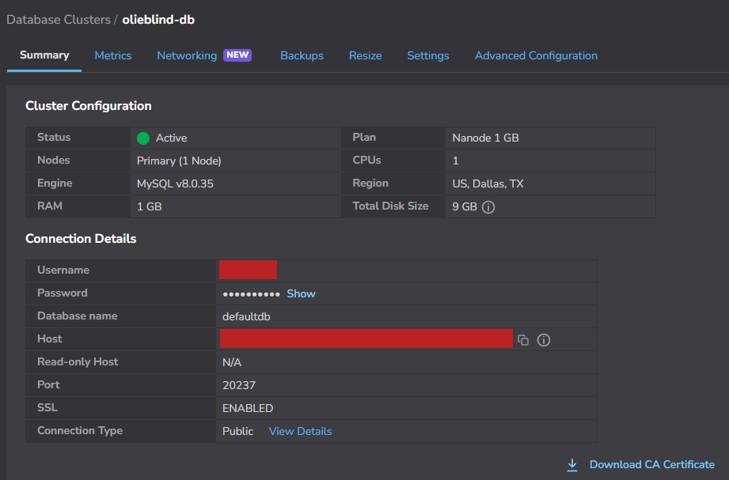
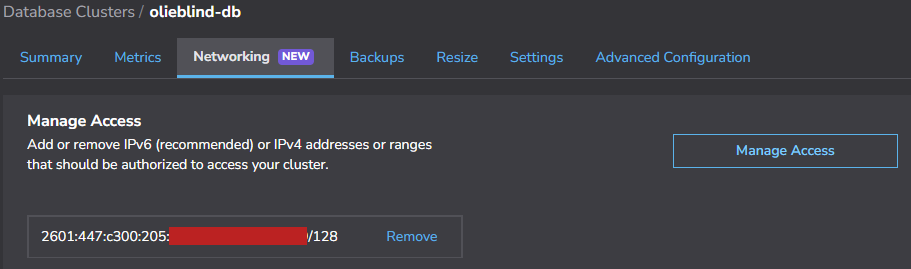
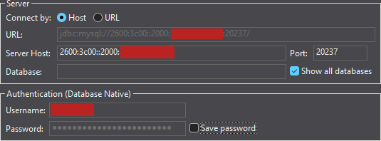
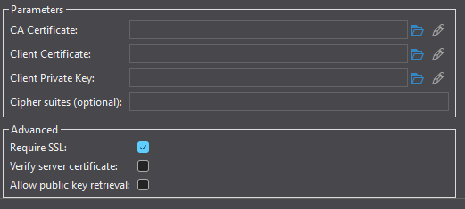
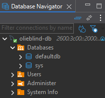
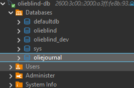
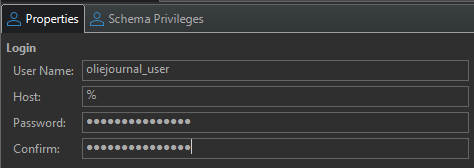
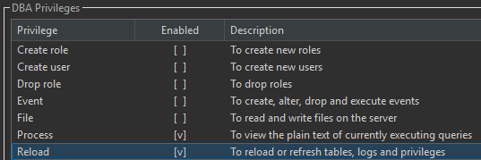
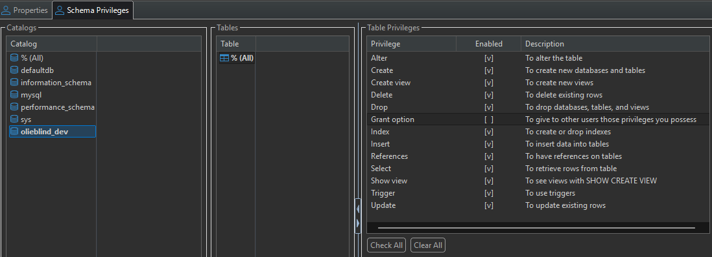
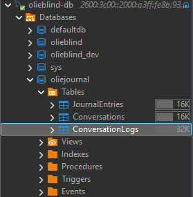

# MySQL
These instrutions guide you through creating a MySQL cluster, connecting to it, creating the database, creating the tables, and creating a login for the website.

## Create the Cluster

Following these steps will result in a usable MySQL instance hosted in Akamai Cloud.

1. Log into Akamai Cloud
2. Navigate to DATABASES -> Databases
3. Click "Create Database Cluster"
4. Fill out the page
    - Cluster Label: oliejournal-db
    - Database Engine: MySQL v8
    - Region: US, Dallas, TX (us-central)
    - Shared CPU
    - Nanode 1 GB
    - Set Number of Nodes: 1 Node
    - Manage Access: Specific Access (recommended)
    - Allowed IP Addresses or Ranges: Put in your public IP address (IPv6 IP recommended)
    - VPC: leave blank
5. Click "Create Database Cluster"
6. You should now see a screen with Connection Details. Make note of the Username, Password, Host, and Port.

It may take up to 30 minutes for the database to be provisioned. Screenshot of a properly provisioned cluster:

## Connect with DBeaver Community
We will open DBeaver Community and configure a connection to our MySQL server. Coming up with this correct combination of settings was quite painful. There was no other way to make an IPv6 connection than plugging the cluster's IPv6 address into the Server Host field.

0. Make sure your IPv6 public address is in the Database Clusters Manage Access list:

1. Open DBeaver Community.
2. Click on the "New Database Connection" icon. 
3. Select "MySQL" and click "Next".
4. Enter the IPv6 address, port, username, and password.

5. Click the  button and select "SSL".
6. Ensure the "Require SSL" is the only checked checkbox.

7. Click the "Test Connection..." button and resolve any errors.
8. Click the Finish button.
9. Rename the connection to "oliejournal-db". Expand the connection to verify it looks like this:

## Create the database
Using DBeaver, we create the database.

1. Using DBeaver, connect to and expand oliejournal-db.
2. Right-Click on Database and select "Create New Database".
3. Database name: oliejournal
4. leave Charset and Collation as the default value. Click "OK"

## Create the website login
Using DBeaver, we create a login for the website.

1. Right-Click on Users and select "Create New User"
2. User Name: oliejournal_user
3. Host: %
3. Put the password in the Password and Confirm fields.

4. Under DBA Privileges only select Process and Reload. These permissions are needed to create mysqldump backups.

5. Click the "Schema Privileges" tab.
6. Select the "oliejournal" Catalog
7. Check All Table Privileges.
8. Uncheck the "Grant option" Table Privilege

9. Click "Save..."
10. When the SQL Preview appears, click "Execute".

## Create the tables
Using DBeaver, we run a script to create the tables.

1. In DBeaver, from the menu, select "Open File".
2. Open the tables.sql file in this folder.
3. Execute the SQL script.
4. Refresh the datbase and expand the Tables to confirm they were created.

The database is now ready.