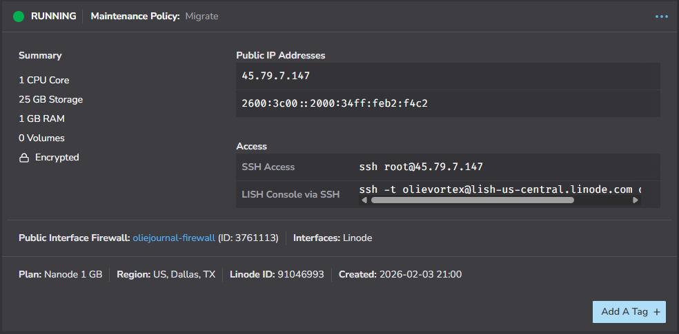

# Akamai Linode
We provision a virtual machine and configure it so we can install our software on it.

## Create the Linode
In the Linode portal, add a new Linode as follows:

- Region: US, Dallas, TX (us-central)
- Choose an OS: Fedora 43
- Linode Plan: Shared CPU -> Nanode 1 GB
- Linode Label: oliejournal
- Root Password: make it a good one. Don't forget it!
- SSH Keys: Select or Add An SSH Key. This is required! We will be disabling password auth. [Manage SSH keys](https://techdocs.akamai.com/cloud-computing/docs/manage-ssh-keys)  - [PuTTYgen](https://www.linode.com/docs/guides/use-public-key-authentication-with-ssh/)
- Disk encryption: checked
- VPC: None
- Assign Firewall: oliejournal-firewall
- Add-ons: None (backups are unreliable)
- Click "Create Linode"

## Update DNS
Now that we have our IPv4 and IPv6 addresses, let's configure DNS. In the Azure Portal, navigate to your DNS Zone.

- Add A, AAAA records for oliejournal

<!-- ## Akamia Database Whitelist
Add the IPv6 address to the olieblind-db access list

- On the Networking tab, click "Manage Access".
- On the drawer, click "Add Another IP".
- Paste in the IPv6 address and click "Update Access Controls".

The GUI updates immediately, but the back-end can take up to 5 mintues for the changes to take effect. -->

## PuTTY profile
We create the oliejournal PuTTY profile.

- Open PuTTY
- Host Name: oliejournal.olievortex.com
- Window -> Columns, Rows: 120, 50
- Window -> Lines of scrollback: 9999
- Connection -> SSH -> Auth -> Credentials -> Private key...: olieblind/olieblind.ppk (point this to the appropriate file created by PuTTYgen).
- Session -> Saved Sessions: oliejournal
- Save

### Create olievortex user, disable root access
Create the olievortex account and prevent root login.

Make a PuTTY connection using the **root** account. It should accept your ssh key without asking for a password. If it asks for a password, the keys are likely not set up correctly in PuTTY.

Run these commands to create a new user called 'olievortex'.

    # adduser olievortex
    # passwd olievortex
    # usermod -aG wheel olievortex
    # cd
    # cp -R .ssh ~olievortex
    # cd ~olievortex
    # chown -R olievortex:olievortex .ssh
    # exit

Create a new PuTTY connection, this time using the **olievortex** user, not **root**.

Now, let's disable root access.

    # cd /etc/ssh
    # sudo vi sshd_config

Change the following settings in sshd_config:

    PermitRootLogin no
    PasswordAuthentication no

Restart sshd for the changes to take effect

    # sudo systemctl restart sshd

In a new PuTTY session, confirm you can no longer lig in as **root**.

### Set hostname

    # sudo hostnamectl set-hostname oliejournal

### Install packages

    # sudo yum update
    # sudo yum install git uv dotnet-sdk-10.0 httpd snapd nodejs-npm mod_ssl tar cronie net-tools mysql

### Firewall Configuration

    # sudo firewall-cmd --permanent --add-service=http
    # sudo firewall-cmd --permanent --add-service=https
    # sudo firewall-cmd --reload

### Clone project for configuration settings

Create a new [SSH key](https://docs.github.com/en/authentication/connecting-to-github-with-ssh/generating-a-new-ssh-key-and-adding-it-to-the-ssh-agent?platform=linux) or copy your existing public/private keys into the .ssh folder.

    # chmod go-r ~/.ssh/id_ed25519
    # eval "$(ssh-agent -s)"
    # ssh-add ~/.ssh/id_ed25519
    # mkdir -p ~/source/repos
    # cd ~/source/repos
    # git clone git@github.com:olievortex/oliejournal.git

### Configure port 80 for certbot

    # cd /var/www/html
    # echo '<html><body>
This is oliejournal
</body></html>' | sudo tee index.html
    # sudo cp ~/source/repos/oliejournal/infrastructure/3_AkamaiLinode/000-oliejournal-default.conf /etc/httpd/conf.d

### Enable Apache

    # sudo systemctl enable httpd
    # sudo systemctl start httpd

Open a browser to oliejournal.olievortex.com and confirm you see "This is oliejournal".

### Install certbot

    # sudo ln -s /var/lib/snapd/snap /snap
    # echo If the next line errors, wait 60 seconds and try again.
    # sudo snap install --classic certbot
    # sudo ln -s /snap/bin/certbot /usr/bin/certbot
    # sudo certbot --apache
    ## Email: olievortex@olievortex.com
    ## Terms of Service: Y
    ## Share email: Y
    #### It should list the following domain name: oliejournal.olievortex.com
    ## Selected domains: 1
    ## Open https://oliejournal.olievortex.com in browser to validate

### Port 80 configuration
Certbot should properly update the configuration. Compare it to this file for any differences.

    ~/source/repos/oliejournal/infrastructure/000-oliejournal-default_after_certbot.conf

### Port 443 configuration
This step is documented in the installation README.

### Configure default editor
Update your .bash_profile to match the editor setting below. This tells crontab what editor to use.

    # .bash_profile

    # Get the aliases and functions
    if [ -f ~/.bashrc ]; then
        . ~/.bashrc
    fi

    # User specific environment and startup programs
    export EDITOR=/usr/bin/vi

### Start crontab
    # sudo systemctl start crond.service

The Linode is now ready for install!
